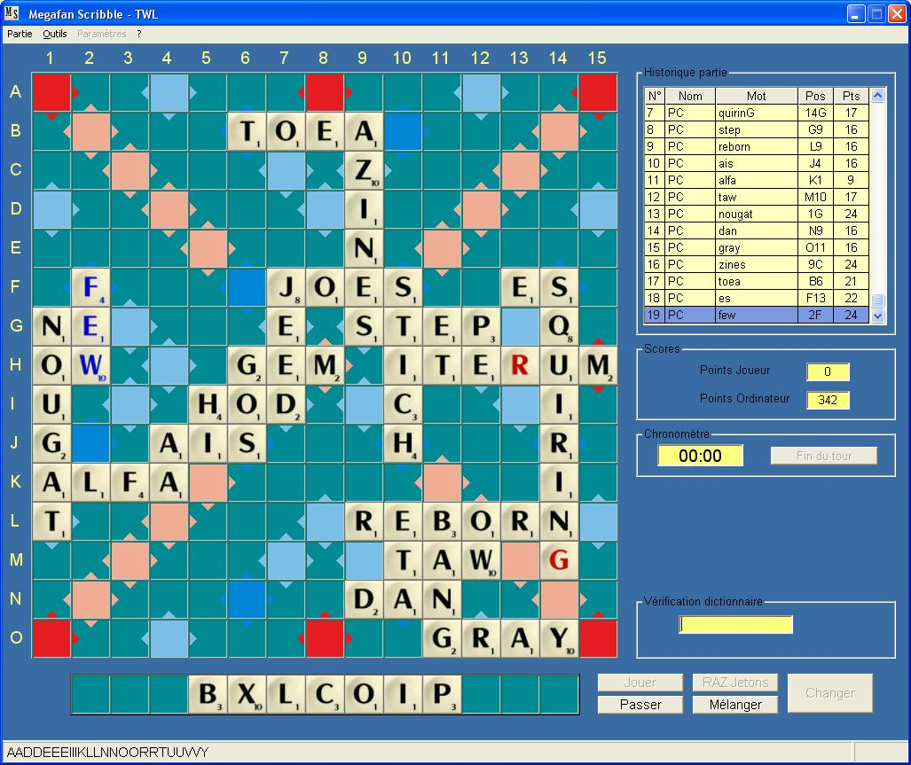



## Megafan Scribble

### Description

It'a a scrabble game like

You can play vs the computer with difficulties set from child (enfant) to best paly(meiileur coup).

You can change the play mode in the 'parametres' menu so you can play in :

normal game (vs computer)

duplicate (same letters for you and computer)

or in solo mode (try to do the best score)

You can also change the dictionnary

- TWL or SOWPODS for English players

- ZINGA for Italians players

- ODS version 5 (2008) pour les Fran&#231;ais.

you can play chronometred parties

In the 'Outils' menu, you can have the 'best word' with 'Meilleure solution'

If you have other dictionnary please feel right to send me them by mail, i will agree to implemente them in the game

Have Fun

Megafan

P.S Sorry for my bad english
 
### More Info
 

             |
---                |---
**Submitted On**   |2008-05-25 10:33:02
**By**             |[Megafan](https://github.com/Planet-Source-Code/PSCIndex/blob/master/ByAuthor/megafan.md)
**Level**          |Intermediate
**User Rating**    |4.8 (19 globes from 4 users)
**Compatibility**  |VB 6\.0
**Category**       |[Games](https://github.com/Planet-Source-Code/PSCIndex/blob/master/ByCategory/games__1-38.md)
**World**          |[Visual Basic](https://github.com/Planet-Source-Code/PSCIndex/blob/master/ByWorld/visual-basic.md)
**Archive File**   |[Megafan\_Sc2113845252008\.zip](https://github.com/Planet-Source-Code/megafan-megafan-scribble__1-70579/archive/master.zip)

